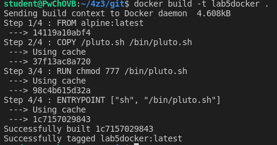
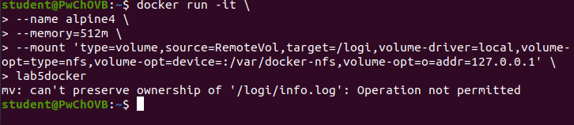
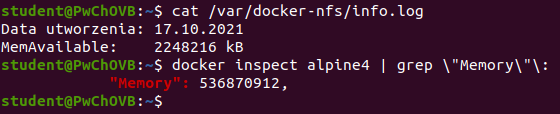

# 2
docker build -t lab5docker .  

# 3
b. nalezy utworzyc folder, ktory bedzie wspodzielony, nadac odpowiednie uprawnienia i     uczynic go publicznym  
sudo mkdir /var/docker-nfs && sudo chown nobody:nogroup /var/docker-nfs && sudo chmod 777 /var/docker-nfs  
c. nalezy w pliku /etc/exports dodac linijke  
/var/docker-nfs 127.0.0.1(rw,sync,no_subtree_check)  \
d. wywolac polecenie: sudo exportfs -a && sudo systemctl restart nfs-kernel-server
# 4
stworzyc wolumen i uruchomic kontener nastepujacym poleceniem:  
docker run -it \  
--name alpine4 \  
--memory=512m \  
--mount 'type=volume,source=RemoteVol,target=/logi,volume-driver=local,volume-opt=type=nfs,volume-opt=device=:/var/docker-nfs,volume-opt=o=addr=127.0.0.1' \  
lab5docker  

# 5
Sprawdzic, czy istnieje plik nastepujacym poleceniem:  
cat /var/docker-nfs/info.log  
Sprawdzic ile pamieci dostepny ma kontener nastepujacym poleceniem:  
docker inspect alpine4 | grep \"Memory\"\:  

